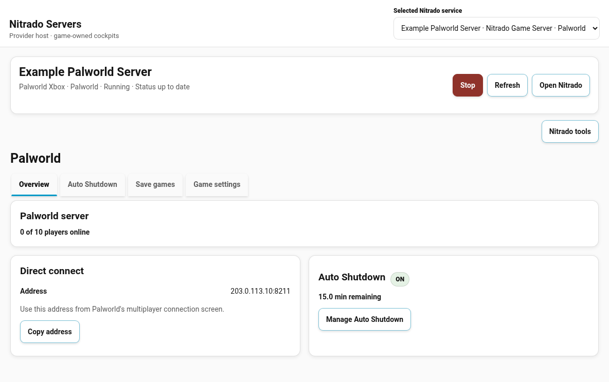
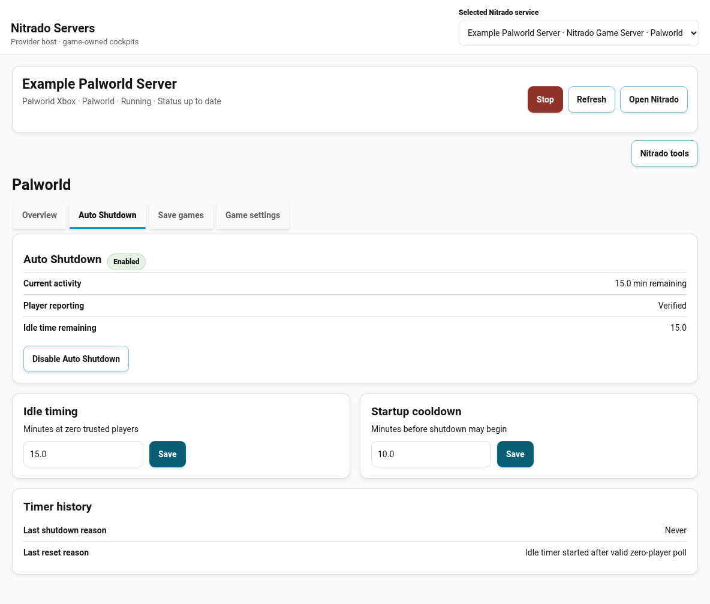
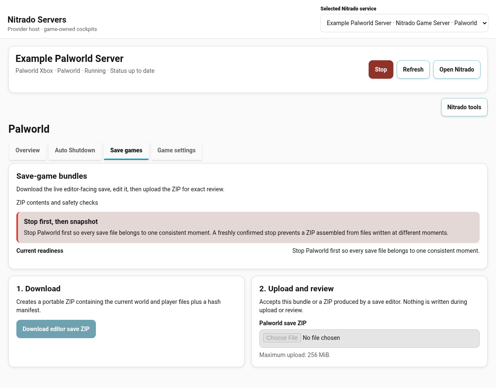
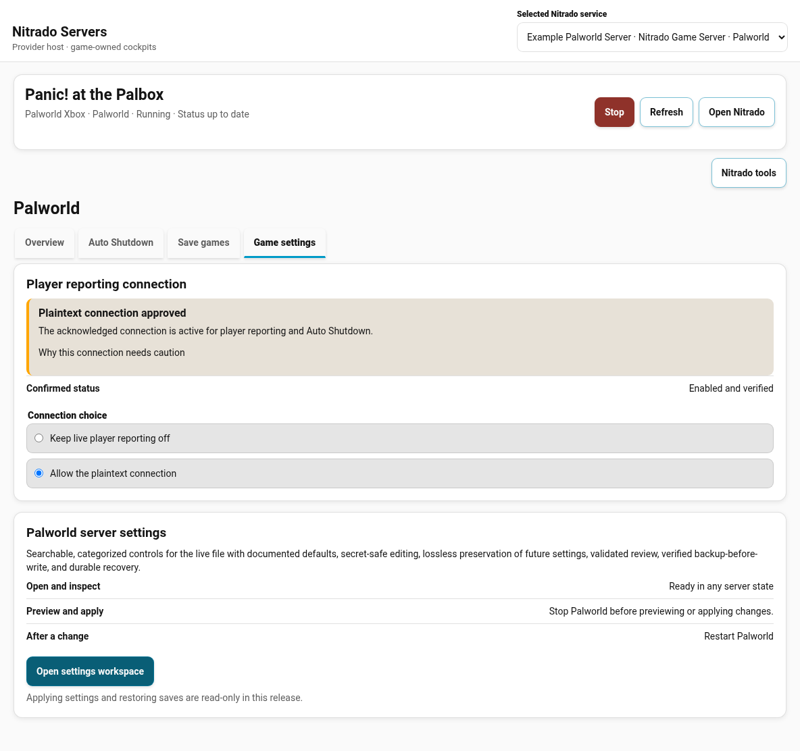
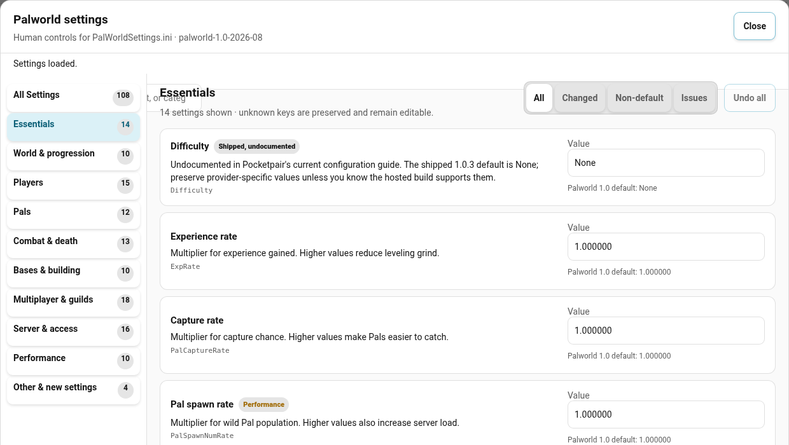
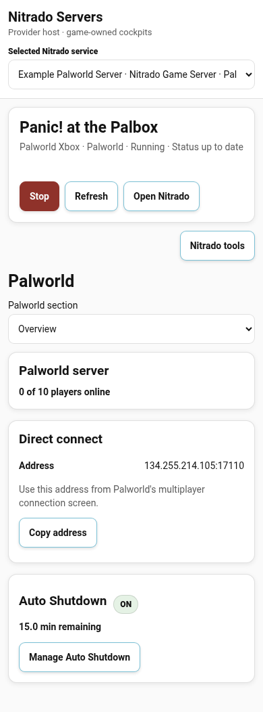
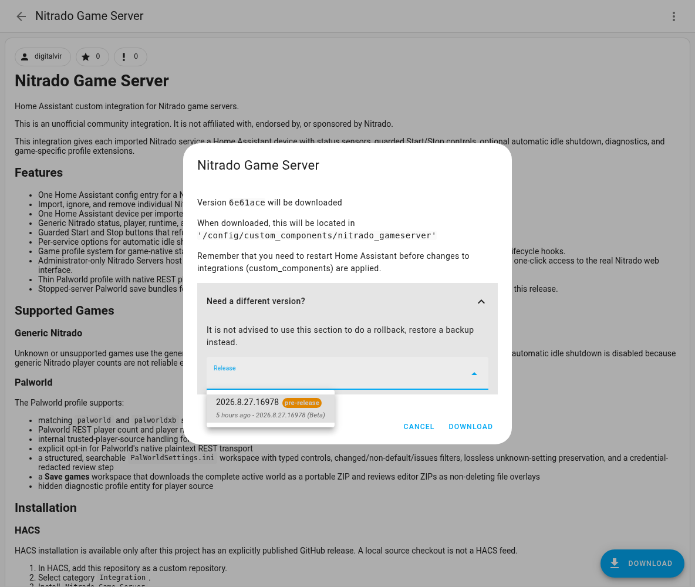
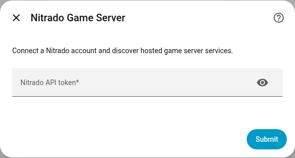

# Nitrado Game Server

Home Assistant custom integration for Nitrado game servers.

This is an unofficial community integration. It is not affiliated with,
endorsed by, or sponsored by Nitrado.

This integration gives each imported Nitrado service a Home Assistant device with status sensors, guarded Start/Stop controls, optional automatic idle shutdown, diagnostics, and game-specific profile extensions.

## Features

- One Home Assistant config entry for a Nitrado account.
- Import, ignore, and remove individual Nitrado game services.
- One Home Assistant device per imported service.
- Generic Nitrado status, player, runtime, and transition sensors.
- Guarded Start and Stop buttons that refuse stale or unsafe control states.
- Per-service options for automatic idle shutdown.
- Game profile system for game-native status enrichment, safety checks, editable files, resources, actions, surfaces, validators, and lifecycle hooks.
- Administrator-only Nitrado Servers host with profile-owned game cockpits, a safe generic fallback, provider controls, and protected one-click access to the real Nitrado web interface.
- Thin Palworld profile with native REST player reporting and conservative game-specific capability decisions.
- Stopped-server Palworld save bundles for editor-friendly download and
  hostile-ZIP-safe upload review. Restore remains disabled in this release.

## Supported Games

### Generic Nitrado

Unknown or unsupported games use the generic profile. The generic profile provides Nitrado status and guarded Start/Stop controls, but automatic idle shutdown is disabled because generic Nitrado player counts are not reliable enough for every game.

### Palworld

The Palworld profile supports:

- matching `palworld` and `palworldxb` services
- Palworld REST player count and player name reporting
- internal trusted-player-source handling for idle shutdown
- explicit opt-in for Palworld's native plaintext REST transport
- a structured, searchable `PalWorldSettings.ini` workspace with typed controls,
  changed/non-default/issues filters, lossless unknown-setting preservation, and
  a credential-redacted review step
- a **Save games** workspace that downloads the complete active world as a
  portable ZIP and reviews editor ZIPs as non-deleting file overlays
- hidden diagnostic profile entity for player source

## Screenshots

### Server overview



### Auto Shutdown



### Save games



### Game settings





### Mobile layout



## Installation

### HACS

HACS installation is available only after this project has an explicitly
published GitHub release. A local source checkout is not a HACS feed.

1. In HACS, open **Custom repositories** and add
   `https://github.com/digitalvir/home-assistant-nitrado-gameserver`.
2. Select category `Integration`.
3. Find `Nitrado Game Server` and choose **Download**.
4. Confirm HACS shows a dotted release version, not a seven-character commit.
   Expand **Need a different version?** only when selecting an older build.
5. Restart Home Assistant.
6. Add the integration from **Settings -> Devices & services -> Add integration -> Nitrado Game Server**.



### Manual

1. Copy `custom_components/nitrado_gameserver` into your Home Assistant `config/custom_components/` directory.
2. Restart Home Assistant.
3. Add the integration from **Settings -> Devices & services -> Add integration -> Nitrado Game Server**.

## Nitrado Token

Create or revoke tokens from Nitrado's official developer-token page:
<https://server.nitrado.net/usa/developer/tokens>. Nitrado does not currently
publish a stable named-scope matrix for every endpoint used here, so this
project documents required endpoint capabilities rather than inventing scope
names.

| Capability | Provider access used | Required? |
| --- | --- | --- |
| Account/service discovery | Read `/services`; `/account` is optional and has a supported fallback | Yes |
| Status and entities | Read gameserver status/details | Yes |
| Manual Start/Stop | Send the service Start/Stop commands | Only if you use controls |
| Palworld players | Read the server's own Palworld REST endpoint after explicit plaintext-HTTP consent | Only for Palworld player reporting/Auto Shutdown |
| Settings/save inspection | Read server files through Nitrado's advertised file access | Only if you use those workspaces |
| Provider-file writes/restores | Not used: all settings apply/rollback and save/native restore gates are disabled | No |

The maintainer has verified the `/account`-restricted fallback and the
read/control paths on one Nitrado account. Nitrado's permission granularity is
provider-controlled and has not yet been independently verified across another
account. Begin with the least authority Nitrado offers for the capabilities you
actually need; do not grant file-write authority for this release.

Treat the token like a password. Do not publish it in issue logs, screenshots, diagnostics, or configuration examples.

The setup field is password-style. The integration identifies the Nitrado account and prevents a second config entry from managing the same account. Replace an expired or rotated token with the integration's Reconfigure flow; a replacement token must resolve to the same Nitrado account.

## Setup

1. Add the `Nitrado Game Server` integration.
2. Paste your Nitrado API token.
3. Finish the account setup.
4. Import discovered services from the integration's discovery cards or options flow.
5. Resolve any game-profile setup decisions shown while importing the service.



Each imported service appears as a Home Assistant device. Services can also be imported, ignored, or removed through the integration options flow.

### First-run checklist

- The config entry loads without a Repair issue.
- At least one service appears as discovered, imported, or ignored.
- Imported services show a fresh status and the expected generic or game profile.
- Start/Stop remain disabled unless the token and fresh server state permit them.
- Palworld player reporting remains unavailable until its REST dependency and
  plaintext-HTTP decision are satisfied.

If setup fails, see [SUPPORT.md](SUPPORT.md). A token that can list `/services`
but cannot read `/account` is supported and should not produce a warning. No
services means either the account has none or the token cannot list them; check
the Nitrado token and web interface before retrying. Reconfigure rotates a token
without creating a second account entry.

Account polling/discovery settings are normalized to safe ranges and take effect through a config-entry reload. Per-service Auto Shutdown switches and timing controls update live without forcing a reload. Game-profile security choices remain available afterward from **Settings -> Devices & services -> Nitrado Game Server -> Configure -> Profile settings** and from the administrator extension panel. Config-entry migration preserves the complete runtime option shape, including enabled Auto Shutdown services.

## Main Entities

Entity names include the Nitrado service display name. Exact entity IDs depend on Home Assistant naming.

Typical entities include:

- `Status`
- `Running`
- `Player Count`
- `Online Players`
- `Player Max`
- `Address`
- `Game`
- `Last Shutdown Reason`
- `Shutdown Pending`
- `Idle Shutdown Minutes`
- `Startup Cooldown Minutes`
- `Auto Shutdown`
- `Start`
- `Stop`
- `Cancel Pending Shutdown`

Diagnostic and developer-facing entities are disabled by default unless they are useful for normal operation.

## Home Assistant Actions

`start`, `stop`, and `cancel_pending_shutdown` accept either a Nitrado service ID or one Home Assistant device target. Device targeting is preferred because automations survive service-ID copy/paste mistakes and present the normal Home Assistant target picker.

The integration also registers `nitrado_gameserver.profile_action`. It bridges game-specific profile actions into Home Assistant automations without requiring direct HTTP calls. Supply a device target, the declared `action_key`, an optional payload, and `confirm: true` when the profile requires confirmation. Profiles may declare typed action inputs so the built-in panel renders real forms and core validates the same payload before dispatch. The Home Assistant action bridge is always administrator/system-only, even when a declaration permits broader access through its HTTP resource surface; internal/system automations remain supported.

All registered actions have runtime voluptuous schemas, so malformed booleans, missing action keys, and unexpected fields fail as clean Home Assistant validation errors.

## Start And Stop Safety

Normal Start and Stop use fresh status data and profile safety checks.

Normal Start refuses to run when:

- status is cached or stale
- the server is not stopped
- the selected game profile blocks Start
- a lifecycle hook blocks Start

Normal Stop refuses to run when:

- status is cached or stale
- the server is not running
- the selected game profile blocks Stop
- a lifecycle hook blocks Stop

Force is not exposed as a normal entity. Administrators may set `force: true`
on the `nitrado_gameserver.start` or `nitrado_gameserver.stop` action when they
deliberately need to bypass an overridable profile or settle-window block.
Fresh status and non-overridable safety failures still fail closed.

## Automatic Idle Shutdown

Automatic idle shutdown is conservative and profile-gated.

The visible control is `Auto Shutdown`. When enabled, the integration can stop a supported game server after the configured zero-player idle period.

Idle shutdown only arms when all of these are true:

- the selected game profile supports idle shutdown for the service
- status is fresh and not cached
- the server status is exactly `started`
- startup cooldown has elapsed
- player data is valid
- player count is explicitly `0`
- maintenance/diagnostic suppression is not active

Before sending Stop, the integration performs final fresh zero-player checks. If any check fails, the timer resets or the shutdown is suppressed.

For Palworld, only fresh Palworld REST data is trusted for automatic shutdown. Source trust remains an internal profile contract. `Allow Palworld REST over plaintext HTTP` is not a normal entity or a player-trust override: it is an administrator security decision shown during service import and available afterward in the integration's standard **Profile settings** options and the advanced extension panel. Enabling it requires explicit confirmation because the Palworld REST Basic-auth credential may cross the public internet without encryption on a hosted server. Use a unique REST password and enable it only if you accept that risk.

Declining or disabling the setting is valid: generic status and manual Start/Stop remain available, but a **running** Palworld server has no trusted live player report and Auto Shutdown cannot be armed. A fresh stable `stopped` status still reports Player Count `0`, because an offline server cannot have connected players. Disabling consent immediately clears running-server player truth, cancels any pending idle shutdown, and turns Auto Shutdown off. Re-enabling restores player reporting only after a valid REST response and deliberately does **not** re-arm Auto Shutdown; the administrator must turn Auto Shutdown back on. If an upgrade introduces a new unresolved acknowledgement, Home Assistant creates a Repair issue and represents Auto Shutdown as unavailable instead of leaving a misleading enabled switch.

## Palworld Notes

Palworld on Nitrado can pass through transitional states such as install, restart, stop, update, and backup restore. The Palworld profile treats those states cautiously.

The bundled Palworld profile does not adopt a world, remember an expected world, schedule save-health checks, or block Start based on save-tree identity. Those are optional save-monitoring policies with their own state and consent requirements, not baseline Nitrado control behavior. Its manual **Save games** workspace is deliberately narrower: it locates the active world, packages exact stopped-server bytes, and hosts upload inspection/review without claiming which world should be authoritative or permitting restore. The proposed provider-independent companion is described in [PALWORLD-SAVE-MONITOR-DESIGN.md](PALWORLD-SAVE-MONITOR-DESIGN.md).

The Palworld profile reads `PalWorldSettings.ini` to discover REST settings. When the server is running, REST is configured, and the administrator has enabled `Allow Palworld REST over plaintext HTTP`, Palworld REST becomes the authoritative player source for status and idle-shutdown decisions. Nitrado's generic/query player values may remain visible in diagnostics, but are not treated as shutdown authority for Palworld because production responses have included false zero-player reports.

REST endpoint candidates come from the Nitrado-reported server address and the
Palworld `PublicIP`/REST port settings stored in that server's own configuration.
Those candidates still pass core's public-address, exact-host, redirect, DNS,
size, and timeout checks. Because an administrator or provider control plane
that can rewrite `PalWorldSettings.ini` can also redirect the game's plaintext
REST credential, use a credential unique to this REST service; the opt-in is a
transport-risk acknowledgement, not a security sandbox.

## Automation Semantics

Automation-facing state is deliberately strict:

- `Player Count` is `0` when fresh provider status is stably `stopped`. When the server is `started`, it is available only from a fresh, non-cached, profile-approved, non-negative player snapshot.
- A numeric `0` therefore means either an authoritatively stopped server or a trusted empty running server, never a failed running-server query dressed in a friendly hat.
- `Player Data Valid` exposes whether the effective count is currently known.
- `Online Players` is `None` while stopped and unavailable when a running-server player report is not trustworthy.
- Starting, stopping, stale, and cached states remain unknown without generating a missing-player complaint.
- `Idle Minutes` and `Idle Time Remaining` are `0` when fresh state proves no countdown exists. They become unavailable only when the integration cannot establish authoritative state needed for Auto Shutdown.
- `Auto Shutdown Status` supplies the semantic state for dashboards: stopped, disabled, paused, waiting for stable status, waiting for zero players, counting down, or final checks. It becomes unavailable only when a required authoritative source is genuinely unavailable.

For an empty **running** server automation, require both `Running == on` and `Player Count == 0`. A stopped server deliberately reports zero; if a running server loses its trusted player source, Player Count becomes unavailable instead of firing the empty-running-server path. The integration's own Auto Shutdown state machine independently enforces running status, freshness, source trust, and explicit zero.

## Extension Endpoints

The integration exposes authenticated Home Assistant HTTP endpoints for profile extension metadata and operations. Profile actions and editable-file operations are administrator-only by default. Resources and surfaces may be available to any authenticated Home Assistant user, but profiles can explicitly require administrator access.

Descriptor endpoint:

```text
/api/nitrado_gameserver/services/{service_id}/extensions
```

The integration also registers an administrator-only **Nitrado Servers** panel in the Home Assistant sidebar at `/nitrado-game-servers`. Core owns account/service selection, provider status and controls, Nitrado tools, authorization, and the safe generic fallback. Installed game profiles may supply their own cockpit module and navigation; the built-in Palworld profile supplies **Overview**, **Auto Shutdown**, **Save games**, and **Game settings**. Unknown games remain manageable without inheriting Palworld terminology or behavior. **Open Nitrado** uses an administrator-bound, service-bound, single-use same-origin handoff; the temporary Nitrado destination is validated and redirected server-side and is never returned to cockpit JavaScript, entity state, diagnostics, or configuration. Device-page **Visit** links use composite account/service routes. The normal integration **Configure** action remains the service/account options flow.

Palworld's **Save games** tab requires a freshly confirmed stopped server for every download and upload comparison. Downloaded ZIPs contain only the live editor-facing world and player files plus a portable hash manifest. Palworld's rolling `backup/` history is excluded before FTPS descends into it; provider paths, credentials, server settings, and Nitrado backup metadata are also excluded. Slow snapshots run as private lease-bound preparation jobs, so the browser polls authenticated status instead of holding one fragile request open; the UI shows the current stage, elapsed time, file/byte counts, current file, and compression progress. Jobs have hard runtime and retention limits and close prepared content on replacement, expiry, reload, or cancellation. Upload accepts that bundle or an editor ZIP, rejects traversal, links, encryption, ambiguous roots, case collisions, backup history, unsupported content, oversized expansion, and decompression bombs, then shows exact add/replace/preserve/delete counts and file hashes. An upload review models a non-deleting overlay: files omitted by a save editor would be preserved and no file would be implicitly deleted. Actual restore remains rejected by the backend gate in this release; download and inspection do not mutate the server.

Palworld's **Game settings** tab owns its one-time plaintext-HTTP player-reporting choice and guarded `PalWorldSettings.ini` workspace. The default view exposes searchable categories, typed controls, saved/default/change context, validation issues, and a human-readable review; a credential-redacted source view remains available for expert inspection. The server patches only selected value spans in the authoritative source so unknown settings, comments, ordering, whitespace, quoting, and line endings survive. Saved secrets never enter the browser and use explicit Keep, Replace, or Clear operations. Reading and drafting work while the game runs; Preview and Apply independently require fresh stopped state and an exact source revision. Apply and Restore remain rejected by the backend gate until controlled live-write acceptance is explicitly approved. Provider diagnostics and recovery stay in separate **Nitrado tools**; filesystem tree replacement and native backup restore remain independently disabled.

Profile extensions can declare:

- Home Assistant entities
- editable files
- save bundles
- read-only resources
- actions
- surfaces
- lifecycle hooks
- validators

`SurfaceDeclaration` is a backend composition contract consumed by the built-in generic panel. Core renders declared parts generically and does not branch on game-specific renderer hints. A separately packaged frontend can still inspect the same descriptor endpoint and provide a specialized renderer for richer hints without requiring game-specific changes in core. Home Assistant entities and `nitrado_gameserver.profile_action` remain the built-in consumers for normal dashboards and automations.

Mutating extension endpoints require explicit confirmation when the declaration says the action is dangerous or when file writes/rollbacks are involved. Authentication is not treated as authorization: administrator-only declarations are enforced against the Home Assistant user attached to each request.

Editable-file responses are redacted by default. Their parsed representation is omitted unless an administrator explicitly requests raw output, because a parser can contain the same secret in a less obvious shape.

The source contains fail-closed editable-file transaction machinery for future controlled validation. In this release, apply and rollback requests are rejected before provider writes. If that independent release gate is ever enabled, the dormant transaction contract requires per-service serialization, a fresh running/stopped check, verified backup-before-write, target read-back, and verified recovery after failure.

## Reliable Provider Filesystem

Nitrado's HTTP file-browser API is useful but is not treated as a trustworthy
general filesystem. Core owns a service-bound multi-transport layer:

- HTTP for bounded metadata/text reads and an independent witness when useful;
- FTPS/FTP for binary data, exact snapshots, recursive traversal, and verified
  tree replacement (disabled in this release);
- the native-backup API as separate inventory plus disabled restore machinery.

Profiles never receive FTP credentials or select a transport. Existing profile
reads are isolated from partial tree mutations and can fall back from failed
HTTP reads to the authoritative transport. Plaintext FTP is disabled unless an
administrator explicitly accepts its network risk for that service.

Heavy companion integrations use the versioned Provider Connector API. Access
requires an exact persistent administrator grant, proven provider capability,
service/root scopes, immutable mutation plans, and core-issued one-shot
approvals. Revocation drains work already past the provider boundary and refuses
anything that has not started. See
[ADR-0002-NITRADO-FILESYSTEM-TRANSPORT.md](ADR-0002-NITRADO-FILESYSTEM-TRANSPORT.md)
and [DEVELOPING_PROVIDER_CONNECTORS.md](DEVELOPING_PROVIDER_CONNECTORS.md).

Source/fake-provider validation is complete. A live secure FTPS connection and
read-only root listing have also been verified. Live recursive mutation claims
remain withheld until the harmless stopped-server temporary-tree checkpoint passes.
Provider-native restore is service-wide and rejected by the release gate. Its
dormant transaction machinery will not be enabled until it is tested on a
disposable Nitrado service; it will never be validated against a production
save tree. Native backup inventory is available. Nitrado native backup creation
is not available through the validated API surface.

## Developer Guide

Built-in game profiles live in `custom_components/nitrado_gameserver/plugins/`. Separately packaged integrations can register profile classes or factories at runtime without editing this repository.

Read [DEVELOPING_PROFILES.md](DEVELOPING_PROFILES.md) before adding a profile. The contract is designed so Minecraft, ARK, Rust, Valheim, Factorio, and other game modules can add game-specific behavior without editing the generic Nitrado core. Bundled game profiles use that same versioned public API; see [ADR-0001-PROFILE-BOUNDARIES.md](ADR-0001-PROFILE-BOUNDARIES.md).

Read [DEVELOPING_PROVIDER_CONNECTORS.md](DEVELOPING_PROVIDER_CONNECTORS.md) when
building a separately packaged product that needs provider files, snapshots, or
native backups. Do not use the game-profile API as a back door to those
capabilities.

## Validation

Run the test suite from the repository root:

```bash
uv lock --check
uv sync --frozen --group test --no-install-project
uv venv .venv-unit --python 3.14
PYTHONDONTWRITEBYTECODE=1 .venv-unit/bin/python -B -m unittest discover -s tests -q
```

Run the real Home Assistant lifecycle harness and lint checks:

```bash
.venv/bin/ruff check --no-cache custom_components tests ha_tests scripts
.venv/bin/ruff format --check --no-cache custom_components tests ha_tests scripts
.venv/bin/bandit -q -r custom_components/nitrado_gameserver -x custom_components/nitrado_gameserver/frontend
PYTHONDONTWRITEBYTECODE=1 .venv/bin/pytest -p no:cacheprovider -q ha_tests
```

Run the executed cockpit behavior tests:

```bash
npm ci
npm audit --audit-level=high
npm run test:frontend
npm run test:browser
```

Run a compile check:

```bash
PYTHONDONTWRITEBYTECODE=1 python3 -B -m py_compile $(rg --files custom_components tests ha_tests scripts -g '*.py')
```

## Diagnostics

Home Assistant diagnostics redact Nitrado-sensitive fields. If you share diagnostics, still review them first. Tokens, passwords, and server admin secrets are credentials, not decorative confetti.

## Support the project

Nitrado Game Server is free and open source. If it saved you time, tedious
setup, or a few creative swear words, you can help keep development moving:

[](https://ko-fi.com/digitalvir)

Support is entirely optional and does not purchase priority support, features,
or roadmap control.

## License

MIT. See [LICENSE](LICENSE) and [NOTICE.md](NOTICE.md).
